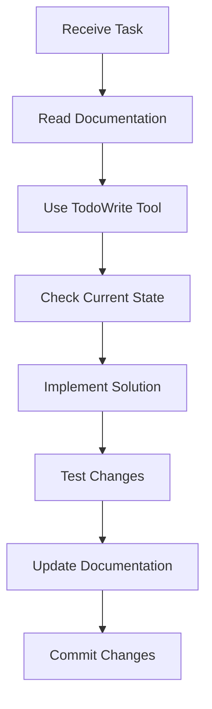

# Claude Code Workflow Guide

## 🚀 Quick Start for Claude

### Before Starting Any Task

1. **Check Current Status**: Read [PROJECT_STATUS.md](PROJECT_STATUS.md)
2. **Review Guidelines**: Check [DEVELOPMENT_GUIDE.md](DEVELOPMENT_GUIDE.md)
3. **Known Issues**: Scan [TROUBLESHOOTING.md](TROUBLESHOOTING.md)
4. **Quick Reference**: Review [QUICK_REFERENCE.md](QUICK_REFERENCE.md)
5. **Sample Code**: Look at `.sample_code_do_not_copy/` directory

### Task Execution Workflow



### After Completing Tasks

1. ✅ Update [PROJECT_STATUS.md](PROJECT_STATUS.md) with completed features
2. 📝 Add learnings to [SESSION_LEARNINGS.md](SESSION_LEARNINGS.md)
3. 🔧 Document issues in [TROUBLESHOOTING.md](TROUBLESHOOTING.md)
4. 💾 Commit changes with descriptive message

## 📋 Task Prioritization

### Priority Levels

1. **🔴 Critical**: Blocking issues, security vulnerabilities, data loss risks
2. **🟠 High**: Feature completions, major bugs, user-facing issues
3. **🟡 Medium**: Enhancements, minor bugs, developer experience
4. **🟢 Low**: Documentation, refactoring, nice-to-haves

### Decision Tree

```
Is it blocking users or development?
├── Yes → Critical Priority
└── No → Is it a bug?
    ├── Yes → Is it user-facing?
    │   ├── Yes → High Priority
    │   └── No → Medium Priority
    └── No → Is it a new feature?
        ├── Yes → Check PROJECT_STATUS.md for priority
        └── No → Low Priority
```

## 🛠️ Common Task Patterns

### Adding a New Feature

1. Review requirements in design_document.md
2. Create TodoWrite items for implementation steps
3. Check existing patterns in SESSION_LEARNINGS.md
4. Implement following DEVELOPMENT_GUIDE.md standards
5. Test thoroughly
6. Update PROJECT_STATUS.md
7. Document any new patterns discovered

### Fixing a Bug

1. Check TROUBLESHOOTING.md for known issues
2. Reproduce the issue
3. Use TodoWrite to track fix steps
4. Implement fix
5. Test fix and edge cases
6. Update TROUBLESHOOTING.md with solution
7. Update PROJECT_STATUS.md if needed

### Refactoring Code

1. Document current state
2. Review DEVELOPMENT_GUIDE.md for patterns
3. Create detailed TodoWrite plan
4. Refactor incrementally
5. Ensure tests pass after each step
6. Update documentation if patterns change

## 🔍 Code Review Checklist

Before committing any changes:

- [ ] TypeScript types are properly defined (no `any`)
- [ ] Code follows patterns in DEVELOPMENT_GUIDE.md
- [ ] Error handling is comprehensive
- [ ] Logging uses correct format
- [ ] Tests are updated/added
- [ ] Documentation is updated
- [ ] No console.log statements left
- [ ] Performance implications considered

## 💡 Best Practices for Claude

### DO's ✅

- Always use TodoWrite for multi-step tasks
- Read existing code before making changes
- Follow established patterns
- Update documentation immediately
- Test changes before committing
- Use semantic commit messages
- Check for similar implementations first

### DON'Ts ❌

- Don't create new patterns without documenting
- Don't ignore TypeScript errors
- Don't skip documentation updates
- Don't commit without testing
- Don't duplicate existing functionality
- Don't use `any` type
- Don't forget to update status

## 🔄 Session Management

### Starting a Session

```typescript
// 1. Read current state
// 2. Set up TodoWrite list
// 3. Review recent commits
// 4. Check for urgent issues
```

### During the Session

```typescript
// 1. Update todos as you progress
// 2. Document discoveries immediately
// 3. Commit frequently with clear messages
// 4. Test continuously
```

### Ending a Session

```typescript
// 1. Complete or document partial work
// 2. Update all documentation
// 3. Clear or organize todos
// 4. Commit all changes
// 5. Leave notes for next session
```

## 📊 Progress Tracking

### Use TodoWrite Tool

- Create todos at task start
- Mark in_progress when starting
- Update immediately upon completion
- Add new todos as discovered
- Never leave stale todos

### Documentation Updates

| Change Type | Required Updates |
|------------|-----------------|
| New Feature | PROJECT_STATUS, SESSION_LEARNINGS |
| Bug Fix | TROUBLESHOOTING, PROJECT_STATUS |
| Refactor | DEVELOPMENT_GUIDE, SESSION_LEARNINGS |
| Pattern Change | DEVELOPMENT_GUIDE, SESSION_LEARNINGS |
| Dependency Update | TECH_STACK, DEVELOPMENT_GUIDE |

## 🚨 When Stuck

1. Check all documentation files
2. Review recent commits for context
3. Look for similar implementations
4. Check external documentation links
5. Document the blocker in PROJECT_STATUS.md
6. Try alternative approaches
7. Leave detailed notes for next session

## 📝 Commit Message Format

```
<type>: <subject>

<body>

<footer>
```

### Types
- `feat`: New feature
- `fix`: Bug fix
- `docs`: Documentation only
- `style`: Formatting, no code change
- `refactor`: Code change that neither fixes nor adds
- `test`: Adding tests
- `chore`: Maintenance

### Example
```
feat: add dark mode toggle to settings

Implemented theme switching using React Context
Updated Park UI components to support theming
Added persistence to localStorage

Closes #123
```

## 🔗 Quick Resource Links

- Local Dev: http://localhost:3000
- Database: http://localhost:4983
- API Docs: http://localhost:3000/swagger
- [ElysiaJS Docs](https://elysiajs.com/llms-full.txt)
- [Drizzle Docs](https://orm.drizzle.team/llms-full.txt)
- [Park UI](https://park-ui.com/)