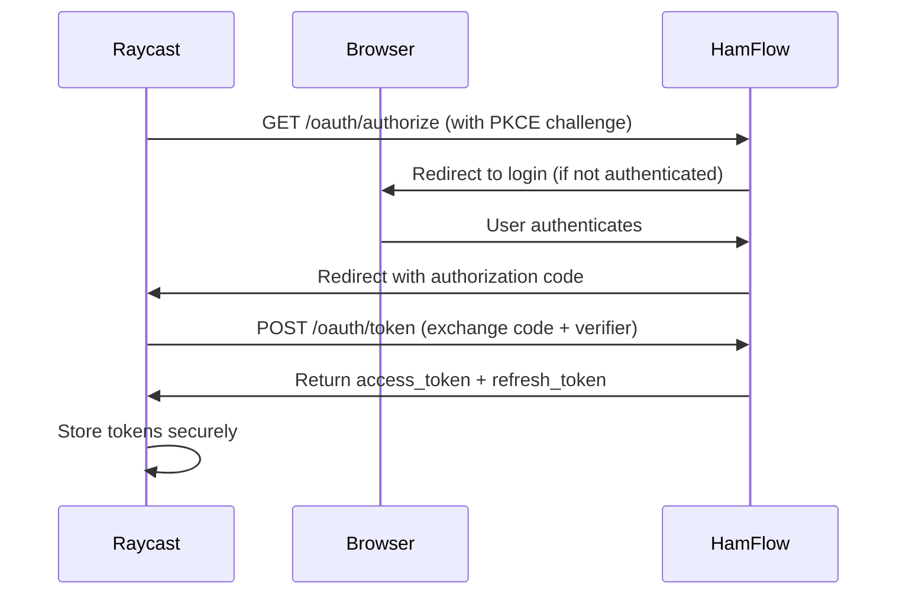

# OAuth Authentication for Raycast Extension

## Overview
Replaced manual API token authentication with OAuth 2.0 (PKCE flow) for a seamless, secure experience.

## What Changed

### Backend (HamFlow Server)
**New File:** `src/server/auth/oauth.ts`

OAuth 2.0 endpoints added:
- `GET /oauth/authorize` - Authorization endpoint
- `POST /oauth/token` - Token exchange & refresh
- `POST /oauth/revoke` - Token revocation (logout)

**Features:**
- ✅ PKCE (Proof Key for Code Exchange) flow for security
- ✅ Short-lived access tokens (1 hour)
- ✅ Long-lived refresh tokens (30 days)
- ✅ Auto-login in development mode
- ✅ In-memory token storage (use Redis in production)

### Frontend (Raycast Extension)
**New Files:**
- `src/lib/oauth.ts` - OAuth client configuration
- `src/authorize.tsx` - Sign-in command

**Updated Files:**
- `src/lib/api.ts` - Uses OAuth tokens instead of API key
- `package.json` - Removed API token preference, added "Sign In" command
- `src/utils/preferences.ts` - Removed apiToken from interface

## User Experience

### Before (API Token)
1. Open HamFlow Settings
2. Click "Generate API Token"
3. Copy token
4. Paste into Raycast preferences
5. Hope you didn't miss any characters 😅

### After (OAuth)
1. Run "Sign In to HamFlow" in Raycast
2. Browser opens → Auto-login (or manual login)
3. Done! ✨

## How It Works



## Token Lifecycle

1. **Access Token**: 1 hour expiry
   - Used for all API requests
   - Automatically refreshed when expired

2. **Refresh Token**: 30 days expiry
   - Used to get new access tokens
   - Stored securely by Raycast
   - Can be revoked

## Development Setup

1. Start HamFlow server: `bun run dev`
2. In Raycast extension preferences, set Server URL: `http://localhost:3000`
3. Run "Sign In to HamFlow" command
4. Browser auto-logins (development mode)
5. Start using commands!

## Production Considerations

**⚠️ Important for Production:**

1. **Token Storage**: Replace in-memory Maps with Redis
   ```typescript
   // Current (dev only)
   const codeStore = new Map();
   const refreshTokenStore = new Map();
   
   // Production (use Redis)
   await redis.set(`auth:code:${code}`, data, 'EX', 300);
   await redis.set(`auth:refresh:${token}`, data, 'EX', 2592000);
   ```

2. **HTTPS Required**: OAuth redirect URIs must use HTTPS
   - Update redirect URI in production env
   - Raycast supports: `https://raycast.com/redirect?packageName=hamflow`

3. **Client ID**: Consider making it configurable per environment

4. **Rate Limiting**: Add rate limiting to OAuth endpoints

5. **Audit Logging**: Log authorization events

## Security Features

- ✅ **PKCE**: Prevents authorization code interception
- ✅ **State Parameter**: CSRF protection
- ✅ **Short-lived Tokens**: 1 hour access tokens
- ✅ **Secure Storage**: Raycast handles token encryption
- ✅ **Token Rotation**: Refresh tokens can be rotated
- ✅ **Revocation**: Users can revoke tokens (logout)

## Debugging

Check OAuth flow:
```bash
# Watch server logs
bun run dev

# Test authorization endpoint
curl "http://localhost:3000/oauth/authorize?client_id=raycast&redirect_uri=https://raycast.com/redirect&code_challenge=test&code_challenge_method=S256"

# Test token exchange (after getting code)
curl -X POST http://localhost:3000/oauth/token \
  -d "grant_type=authorization_code" \
  -d "client_id=raycast" \
  -d "code=YOUR_CODE" \
  -d "code_verifier=YOUR_VERIFIER"
```

## Benefits

✅ **Better UX**: One-click sign in  
✅ **More Secure**: No copy-pasting tokens  
✅ **Auto Refresh**: Tokens refresh automatically  
✅ **Native Feel**: Integrates with Raycast's OAuth system  
✅ **Logout Support**: Raycast shows logout in preferences  

## Migration Guide

For users upgrading from API token version:

1. Update to latest version
2. Remove old API token from preferences (no longer needed)
3. Run "Sign In to HamFlow" command
4. Enjoy! 🎉

---

**Note**: The old API token system still works for other integrations. OAuth is specifically for Raycast.
